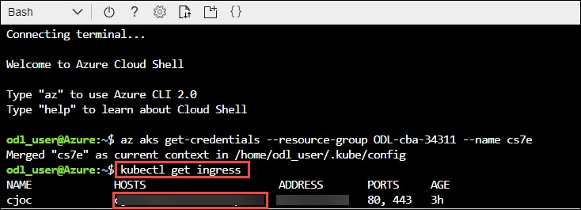

# Introduction
Cloudbees repo

# Sign-up for Workshop Environment

To make it easier for you to work on the labs, you are provided with pre-provisioned Azure environment. You will receive sign-up link for the lab environment from your instructor.

* Register for the lab environment by providing your information and clicking on **Submit** button.


* On the next page, click the **Launch Lab** button.


* Wait for the lab environment to be provisioned. Sometimes this can take upto **10 minutes**. Once environment provisioning is complete, you will receive details in email as well as in the browser.


 > Note: Lab environment is enabled only for specific duration or workshop end time - whichever is earlier. At the end of the allowed time, environment will be self-destructed.
 
 
* Login in azure portal,Launch cloud shell.


* In cloud shell click on **advanced settings**


* Choose existing RG, create new storage account and file, click on **create storage**


* Now you can see storage is successfully created.


* Run following command Connect to AKS Cluster via CloudShell or AZ CLI.
    ```
    az aks get-credentials --resource-group myAKSCluster --name myAKSCluster
     ```


* Run following command Verify deployments by ensure cjoc-0 pod is running. If status is creating etc, you should wait for about 2 minutes for completion
     ```
    kubectl get pods
     ```


* Run following command to find admin password of jenkins instance.
     ```
    kubectl exec cjoc-0 -- cat /var/jenkins_home/secrets/initialAdminPassword
     ```


* Run following command to find DNS name of CJOC, from this command you will get jenkins URL.
     ```
     kubectl get ingress
    ```


* Now access the Jenkins URL in browser.


* Enter the Password of jenkins.


* Click on **Request on trial license**.


* Now fill the details for signup-trial and click on **submit**.


* Select the **Installed suggested plugins**.


* It will started the all services of cloudbees.


* Now you will instance configuration,click on **save&finish**


* Ready the operation center, Click on **start using operation center**.


* It will redirect the jenkins page and create new jenkins-master.


* Create new master and click on **go**.
.

* Go with default configuration and click on **save**.


* Now you can see the jenkins master is created successfully.


* Now jenkins-master is listed on jenkins dashboard.


